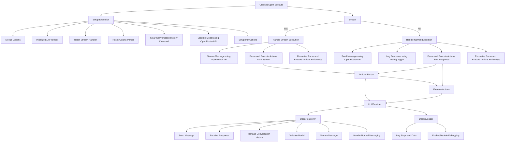
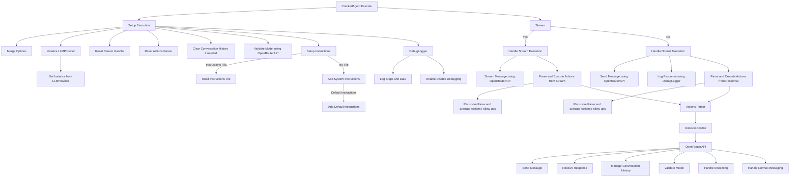

# CrackedAgent Application Flow

This document outlines the detailed flow of the `CrackedAgent` class, which manages interactions with a Language Model (LLM) to parse and execute actions based on the messages it receives. The primary interaction is through the `LLMProvider`, which uses the `OpenRouterAPI` to communicate with the OpenRouter service.

## Interactions with Key Components

### Execution Flow

1. **Initialization**:
   - `CrackedAgent` is instantiated with dependencies: `FileReader`, `ActionsParser`, `LLMContextCreator`, `DebugLogger`, and `StreamHandler`.
   - `LLMProvider` is configured and initialized.

2. **Execute Method**:
   - Input messages and options are processed and merged.
   - Message context is created, and the model is validated.
   - Depending on the `stream` option, normal or stream execution is handled.

### Stream Handling

- If streaming, responses are processed in chunks and actions are parsed and executed recursively.

### Parsing and Executing Actions

- Actions from LLM responses are parsed using `ActionsParser`.
- Each action is executed, and results are logged using `DebugLogger`.
- Follow-up messages are processed recursively.

### LLM Interaction with `OpenRouterAPI`

- Key methods include `sendMessage`, `sendMessageWithContext`, `clearConversationContext`, `getConversationContext`, `addSystemInstructions`, `getAvailableModels`, `validateModel`, `getModelInfo`, and `streamMessage`.

### Debugging

- `DebugLogger` controls debugging, which can be enabled or disabled via options.

## Mermaid Diagram

Below is a Mermaid diagram illustrating the interaction between key components.



This document outlines the detailed flow of the `CrackedAgent` class, which manages interactions with a Language Model (LLM) to parse and execute actions based on the messages it receives. The primary interaction occurs through the `LLMProvider`, which uses the `OpenRouterAPI` to communicate with the OpenRouter service.

## Sequence of Execution
### Overview of CrackedAgent Workflow

The `CrackedAgent` class is designed to interact with a Language Model (LLM) to parse and execute actions based on messages it receives. It leverages several key dependencies to manage file operations, parse actions, and handle streaming or normal execution.

#### Dependencies

- **FileReader**: Manages reading files, crucial for fetching instruction files.
- **ActionsParser**: Parses and executes actions extracted from the LLM responses.
- **LLMContextCreator**: Creates the context for messages to be sent to the LLM.
- **DebugLogger**: Handles logging for debugging purposes.
- **StreamHandler**: Manages streaming interactions with the LLM.

#### Initialization

- **CrackedAgent Initialization**:
  - The `CrackedAgent` class is instantiated with necessary dependencies: `FileReader`, `ActionsParser`, `LLMContextCreator`, `DebugLogger`, and `StreamHandler`.
  - The `LLMProvider` is configured with the specified LLM provider, defaulting to `OpenRouterAPI`.

Example:
```typescript
const crackedAgent = new CrackedAgent({
  fileReader: new FileReader(),
  actionsParser: new ActionsParser(),
  llmContextCreator: new LLMContextCreator(),
  debugLogger: new DebugLogger(),
  streamHandler: new StreamHandler(),
  llmProviderConfig: {
    model: 'gpt-3.5-turbo',
    provider: 'OpenRouterAPI',
  }
});
```

#### Execute Method

- **Processing Input**:
  - The `execute` method processes the input message and options.
  - It sets up execution by merging default options and initializing the LLM.
  - A context for the message is created and the model is validated.

Example:
```typescript
const response = await crackedAgent.execute({
  message: 'Generate a report for the last quarter.',
  options: {
    stream: false,
    debug: true,
    instructions: 'path/to/instructions.txt',
  }
});
```

#### Setup Execution

- **Merging Options**:
  - Default options are merged with any provided options.
- **Initializing LLMProvider**:
  - The LLM provider is initialized using `LLMProvider.getInstance`.
  - Stream handler and actions parser are reset.
  - Conversation history is cleared if requested.
  - Model validation is performed using `OpenRouterAPI`.
  - Instructions are set up, either from the provided path or default instructions.

Example:
```typescript
const setupConfig = await crackedAgent.setupExecution({
  message: 'Generate a report for the last quarter.',
  options: {
    stream: false,
    debug: true,
    instructions: 'path/to/instructions.txt',
  }
});
```

#### Handle Normal Execution

- **Sending Message**:
  - A message is sent to the LLM using `OpenRouterAPI`.
  - The response is logged using `DebugLogger`.
- **Parsing and Executing Actions**:
  - Actions in the response are parsed and executed.
  - The response and any actions are returned.

Example:
```typescript
const response = await crackedAgent.handleNormalExecution({
  message: 'Generate a report for the last quarter.',
  options: {
    debug: true,
  }
});
```

#### Handle Stream Execution

- **Streaming Message**:
  - A message is streamed to the LLM using `OpenRouterAPI`, appending each chunk to the buffer.
  - Actions from the stream buffer are parsed and executed.
  - The response and any actions are returned.

Example:
```typescript
const response = await crackedAgent.handleStreamExecution({
  message: 'Generate a report for the last quarter.',
  options: {
    debug: true,
  }
});
```

#### Parse and Execute Actions

- **Parsing Actions**:
  - Actions from the response or stream buffer are parsed using `ActionsParser`.
- **Executing Actions**:
  - Each action is executed, and results are logged using `DebugLogger`.
  - Follow-up messages are processed recursively.

#### LLM Interaction with OpenRouterAPI

- **Method Details**:
  - `sendMessage` for sending non-streaming messages.
  - `sendMessageWithContext` for messages with system instructions.
  - `clearConversationContext` for clearing conversation history.
  - `getConversationContext` for retrieving the current conversation context.
  - `addSystemInstructions` for adding system-level instructions.
  - `getAvailableModels` for fetching available models from the provider.
  - `validateModel` for validating the specified model.
  - `getModelInfo` for retrieving detailed information about a specific model.
  - `streamMessage` for streaming messages.

#### Debugging

- **Debugging Control**:
  - The `DebugLogger` logs various steps and data for debugging.
  - Debugging can be enabled or disabled based on the `debug` option.

Example:
```typescript
crackedAgent.debugLogger.enable();
crackedAgent.debugLogger.log('Debugging is enabled');
```
### Initialization

1. **CrackedAgent Initialization**:
   - The `CrackedAgent` class is instantiated with necessary dependencies: `FileReader`, `ActionsParser`, `LLMContextCreator`, `DebugLogger`, and `StreamHandler`.
   - The `LLMProvider` is configured with the specified LLM provider, defaulting to `OpenRouterAPI`.

### Execute Method

1. **Processing Input**:
   - The `execute` method processes the input message and options.
   - It sets up execution by merging default options and initializing the LLM.
   - A context for the message is created and the model is validated.

2. **Stream Handling**:
   - Depending on the `stream` option, the agent either handles normal execution or streaming execution.

### Setup Execution

1. **Merging Options**:
   - Default options are merged with any provided options.
2. **Initializing LLMProvider**:
   - The LLM provider (`OpenRouterAPI`) is initialized using `LLMProvider.getInstance`.
   - The stream and actions parser are reset.
   - The conversation history is cleared if requested.
   - The model is validated using `OpenRouterAPI`.
   - Instructions are set up, either from the provided path or default instructions.

### Handle Normal Execution

1. **Sending Message**:
   - A message is sent to the LLM using `OpenRouterAPI`.
   - The response is logged.
2. **Parsing and Executing Actions**:
   - Actions in the response are parsed and executed.
   - The response and any actions are returned.

### Handle Stream Execution

1. **Streaming Message**:
   - A message is streamed to the LLM using `OpenRouterAPI`, appending each chunk to the buffer.
   - Actions from the stream buffer are parsed and executed.
   - The response and any actions are returned.

### Parse and Execute Actions

1. **Parsing Actions**:
   - Actions from the response or stream buffer are parsed using `ActionsParser`.
2. **Executing Actions**:
   - Each action is executed, and results are logged using `DebugLogger`.
   - Follow-up messages are processed recursively.

### LLM Interaction with OpenRouterAPI

1. **Method Details**:
   - `sendMessage` for sending non-streaming messages.
   - `sendMessageWithContext` for messages with system instructions.
   - `clearConversationContext` for clearing conversation history.
   - `getConversationContext` for retrieving the current conversation context.
   - `addSystemInstructions` for adding system-level instructions.
   - `getAvailableModels` for fetching available models from the provider.
   - `validateModel` for validating the specified model.
   - `getModelInfo` for retrieving detailed information about a specific model.
   - `streamMessage` for streaming messages.

### Debugging

1. **Debugging Control**:
   - The `DebugLogger` logs various steps and data for debugging.
   - It can be enabled or disabled based on the `debug` option.

## Mermaid Diagram
### Detailed Steps and Examples

#### Initialization
- **CrackedAgent Instantiation**:
  - The `CrackedAgent` class is instantiated with essential dependencies: `FileReader`, `ActionsParser`, `LLMContextCreator`, `DebugLogger`, and `StreamHandler`.
  - Configuration includes setting up the `LLMProvider`, which defaults to `OpenRouterAPI`.

Example:
```typescript
const crackedAgent = new CrackedAgent({
  fileReader: new FileReader(),
  actionsParser: new ActionsParser(),
  llmContextCreator: new LLMContextCreator(),
  debugLogger: new DebugLogger(),
  streamHandler: new StreamHandler(),
  llmProviderConfig: {
    model: 'gpt-3.5-turbo',
    provider: 'OpenRouterAPI',
  }
});
```

#### Execute Method
- **Processing Input**:
  - The `execute` method handles input messages and options.
  - It sets up execution by merging default options and initializing the LLM.
  - A context is created for the message, and the model is validated.

Example:
```typescript
const response = await crackedAgent.execute({
  message: 'Generate a report for the last quarter.',
  options: {
    stream: false,
    debug: true,
    instructions: 'path/to/instructions.txt',
  }
});
```

#### Setup Execution
- **Merging Options**:
  - Default options are merged with any provided options.
- **Initializing LLMProvider**:
  - The LLM provider is initialized using `LLMProvider.getInstance`.
  - Stream handler and actions parser are reset.
  - Conversation history is cleared if requested.
  - Model validation is performed using `OpenRouterAPI`.
  - Instructions are set up, either from the provided path or default instructions.

Example:
```typescript
const setupConfig = await crackedAgent.setupExecution({
  message: 'Generate a report for the last quarter.',
  options: {
    stream: false,
    debug: true,
    instructions: 'path/to/instructions.txt',
  }
});
```

#### Handle Normal Execution
- **Sending Message**:
  - A message is sent to the LLM using `OpenRouterAPI`.
  - The response is logged using `DebugLogger`.
- **Parsing and Executing Actions**:
  - Actions in the response are parsed and executed.
  - The response and any actions are returned.

Example:
```typescript
const response = await crackedAgent.handleNormalExecution({
  message: 'Generate a report for the last quarter.',
  options: {
    debug: true,
  }
});
```

#### Handle Stream Execution
- **Streaming Message**:
  - A message is streamed to the LLM using `OpenRouterAPI`, appending each chunk to the buffer.
  - Actions from the stream buffer are parsed and executed.
  - The response and any actions are returned.

Example:
```typescript
const response = await crackedAgent.handleStreamExecution({
  message: 'Generate a report for the last quarter.',
  options: {
    debug: true,
  }
});
```

#### Specific LLM Methods
- **`sendMessage`**:
  - Sends a non-streaming message to the LLM.
- **`sendMessageWithContext`**:
  - Sends a message to the LLM with additional system instructions.
- **`clearConversationContext`**:
  - Clears the conversation history.
- **`getConversationContext`**:
  - Retrieves the current conversation context.
- **`addSystemInstructions`**:
  - Adds system-level instructions.
- **`getAvailableModels`**:
  - Fetches available models from the provider.
- **`validateModel`**:
  - Validates the specified model.
- **`getModelInfo`**:
  - Retrieves detailed information about a specific model.
- **`streamMessage`**:
  - Streams a message to the LLM.

Example:
```typescript
const availableModels = await crackedAgent.llmProvider.getAvailableModels();
const modelInfo = await crackedAgent.llmProvider.getModelInfo('gpt-3.5-turbo');
```

#### Debugging
- **Debugging Control**:
  - The `DebugLogger` logs various steps and data for debugging.
  - Debugging can be enabled or disabled based on the `debug` option.

Example:
```typescript
crackedAgent.debugLogger.enable();
crackedAgent.debugLogger.log('Debugging is enabled');
```
Below is a Mermaid diagram illustrating the interaction between key components.

