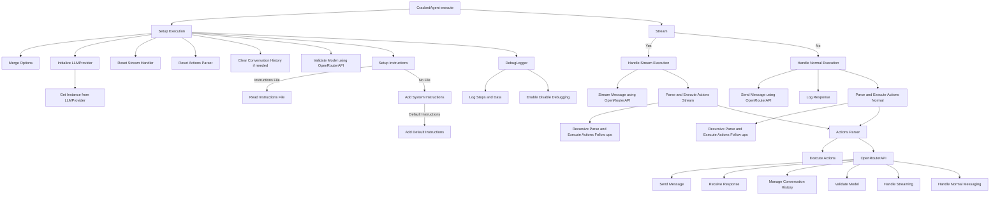

# CrackedAgent Application Flow

This document outlines the critical path application flow starting from `CrackedAgent.ts`. The `CrackedAgent` class interacts with a Language Model (LLM) to parse and execute actions based on the messages it receives. The primary interaction occurs through the `LLMProvider`, which utilizes the `OpenRouterAPI` to communicate with the OpenRouter service.

## Sequence of Execution

1. **Initialization**:

   - The `CrackedAgent` initializes with dependencies including `FileReader`, `ActionsParser`, `LLMContextCreator`, `DebugLogger`, and `StreamHandler`.
   - The `LLMProvider` is instantiated and configured with the `OpenRouterAPI`.

2. **Execute Method**:

   - The `execute` method processes the input message and options.
   - It sets up execution by merging default options and initializing the LLM.
   - A context for the message is created and the model is validated.
   - Depending on the `stream` option, it either handles normal execution or streaming execution.

3. **Setup Execution**:

   - Default options are merged with provided options.
   - The LLM provider (`OpenRouterAPI`) is initialized using `LLMProvider.getInstance`.
   - The stream and actions parser are reset.
   - The conversation history is cleared if requested.
   - The model is validated using `OpenRouterAPI`.
   - Instructions are set up, either from the provided path or default instructions.

4. **Handle Normal Execution**:

   - A message is sent to the LLM using `OpenRouterAPI` and the response is logged.
   - Any actions in the response are parsed and executed.
   - The response and any actions are returned.

5. **Handle Stream Execution**:

   - A message is streamed to the LLM using `OpenRouterAPI`, appending each chunk to the buffer.
   - Actions from the stream buffer are parsed and executed.
   - The response and any actions are returned.

6. **Parse and Execute Actions**:

   - Actions from the response or stream buffer are parsed using `ActionsParser`.
   - Each action is executed and results are logged using `DebugLogger`.
   - Follow-up messages are processed recursively.

7. **LLM Interaction with OpenRouterAPI**:

   - The `OpenRouterAPI` sends messages to the model and receives responses.
   - It manages conversation history and model validation.
   - It handles both streaming and normal message exchanges.

   Methods include:

   - `sendMessage` for sending non-streaming messages.
   - `sendMessageWithContext` for messages with system instructions.
   - `clearConversationContext` for clearing conversation history.
   - `getConversationContext` for retrieving the current conversation context.
   - `addSystemInstructions` for adding system-level instructions.
   - `getAvailableModels` for fetching available models from the provider.
   - `validateModel` for validating the specified model.
   - `getModelInfo` for retrieving detailed information about a specific model.
   - `streamMessage` for streaming messages.

8. **Debugging**:

   - The `DebugLogger` logs various steps and data for debugging.
   - It can be enabled or disabled based on the `debug` option.

## Mermaid Diagram

