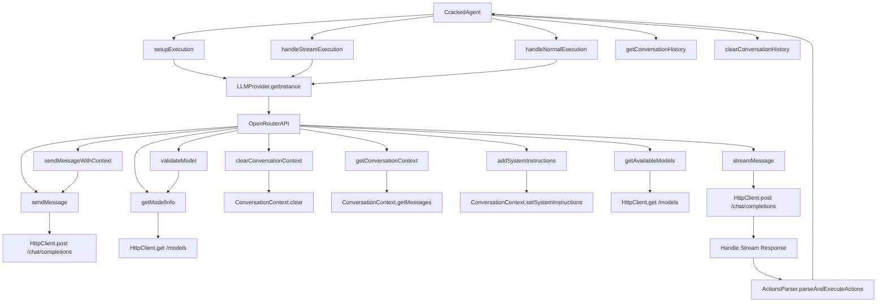

````markdown
# Technical Architecture

## Overview

This document describes the technical architecture of the Cracked Dev CLI application, focusing on key components responsible for processing and interacting with Large Language Models (LLMs).

## Key Components

### 1. CrackedAgent

- **Purpose**: Main class responsible for executing instructions and managing the conversation.
- **Dependencies**:
  - `FileReader`
  - `LLMContextCreator`
  - `DebugLogger`
  - `ActionsParser`
  - `StreamHandler`
- **Responsibilities**:
  - Sets up execution options.
  - Formats messages to be sent to the LLM.
  - Handles both standard and streaming message executions.
  - Manages conversation history.

### 2. LLMProvider

- **Purpose**: Singleton class that manages different types of LLM providers.
- **Responsibilities**:
  - Provides a unified interface to interact with different LLM providers.
  - Routes messages to the appropriate provider implementation based on the specified provider type.

### 3. OpenRouterAPI

- **Purpose**: Concrete implementation of the `ILLMProvider` interface for the OpenRouter LLM provider.
- **Responsibilities**:
  - Sends and streams messages to the OpenRouter API.
  - Manages conversation context.
  - Validates models.

## Interactions and Flow

### Initialization

1. **CrackedAgent** is instantiated with necessary dependencies.
2. **LLMProvider** is initialized with the OpenRouter provider.

### Execution

1. **CrackedAgent.execute** is called with user input and options.
2. Options are validated and set up.
3. Messages are formatted and sent to the LLM provider via **LLMProvider**.
4. **LLMProvider** routes the message to **OpenRouterAPI** based on the provider type.
5. **OpenRouterAPI** interacts with the OpenRouter API to send or stream messages based on the execution mode.
6. Responses are processed and added to the conversation context.
7. Responses are parsed for actions by **ActionsParser** and executed.

### Actions Parsing & Execution

- Responses from the LLM are parsed to identify and execute any actions specified in the response.

### Logging and Debugging

- **DebugLogger** is used throughout the process to log various debug information, if debug mode is enabled.

## Diagram

Below is a Mermaid diagram that visually represents the interaction between these components.


````
