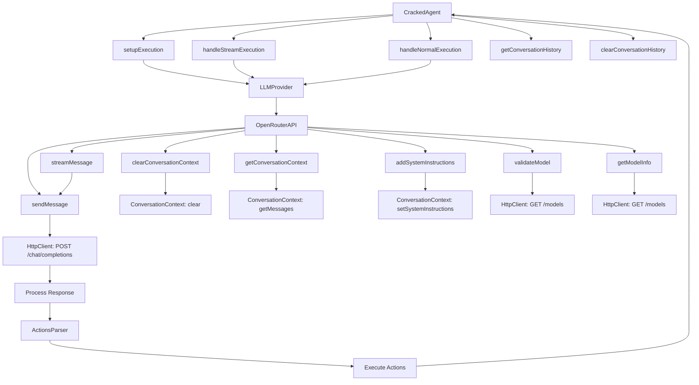

# Technical Architecture

## Overview

This document outlines the technical architecture of the Cracked Dev CLI application, focusing on the core components managing instructions and interactions with Large Language Models (LLMs).

## Key Components

### 1. CrackedAgent

- **Purpose**: Manages overall execution and interaction processes.
- **Dependencies**:
  - `FileReader`
  - `LLMContextCreator`
  - `DebugLogger`
  - `ActionsParser`
  - `StreamHandler`
- **Responsibilities**:
  - Validate and configure execution options.
  - Format user input messages for transmission to the LLM.
  - Control standard and streaming message transmissions.
  - Maintain and retrieve the conversation history.

### 2. LLMProvider

- **Purpose**: Acts as a unified interface for various LLM providers.
- **Responsibilities**:
  - Provide a consistent API for interaction regardless of the LLM provider.
  - Route messages to the appropriate provider based on user configuration.

### 3. OpenRouterAPI

- **Purpose**: Specifically implements the interface `ILLMProvider` for the OpenRouter LLM.
- **Responsibilities**:
  - Handle message sending and streaming to the OpenRouter API.
  - Manage conversation context within the interaction.
  - Verify the availability and appropriateness of models.

## Interactions and Flow

### Initialization

1. **CrackedAgent** is instantiated with all necessary dependencies injected.
2. **LLMProvider** is initialized and configured to use the OpenRouter provider by default.

### Execution

1. **CrackedAgent.execute()** is invoked with user input and specific execution options.
2. Input options are validated and prepared according to application rules.
3. Messages, formatted to be clear and contextually relevant, are sent to the LLM provider through **LLMProvider**.
4. **LLMProvider**, based on the provider type (e.g., OpenRouter), directs messages further.
5. **OpenRouterAPI** then interacts with the OpenRouter API, sending or streaming messages as required.
6. Responses from the API are processed and added to the conversation context.
7. **ActionsParser** identifies any actions in these responses and triggers their execution.

### Actions Parsing & Execution

- After parsing the LLM responses, **ActionsParser** extracts and executes any planned actions.

### Logging and Debugging

- **DebugLogger** logs detailed debug information throughout the process, aiding in troubleshooting and development, conditionally enabled via configuration.

## Diagram

Below is a Mermaid diagram illustrating the interaction between the key components.

