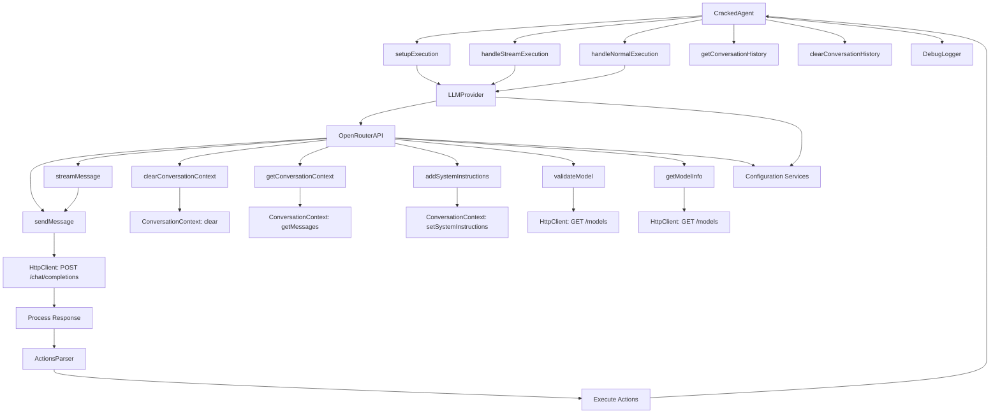

# Technical Architecture

This document outlines the technical architecture of the Cracked Dev CLI application, focusing on core components managing instructions and interactions with Large Language Models (LLMs). The application is modular, allowing for easy integration and scaling of different LLM providers.

## Key Components

### 1. CrackedAgent

**Purpose**: Manages overall execution and interaction processes.

- **Dependencies**:
  - `FileReader`: Reads and handles files for processing.
  - `LLMContextCreator`: Creates and manages context for LLM interactions.
  - `DebugLogger`: Logs debug information.
  - `ActionsParser`: Parses and executes actions from LLM responses.
  - `StreamHandler`: Manages streaming interactions with the LLM.

- **Responsibilities**:
  - Validate and configure execution options.
  - Format user input messages for transmission to the LLM.
  - Control message transmissions (standard and streaming).
  - Maintain and retrieve conversation history.
  - Manage and execute actions derived from LLM responses.

### 2. LLMProvider

**Purpose**: Acts as a unified interface for various LLM providers.

- **Responsibilities**:
  - Provide a consistent API for interaction regardless of the LLM provider.
  - Route messages to the appropriate provider based on user configuration.
  - Handle authentication and API token management.

### 3. OpenRouterAPI

**Purpose**: Implements `ILLMProvider` specifically for OpenRouter LLM.

- **Responsibilities**:
  - Handle message sending and streaming to the OpenRouter API.
  - Manage conversation context within interactions.
  - Verify model availability.
  - Handle API communication errors and retries.

### 4. FileReader

**Purpose**: Reads and processes files based on user input.

- **Responsibilities**:
  - Read files from specified paths.
  - Format and preprocess file contents for the LLM.
  - Return file data to `CrackedAgent`.

### 5. ActionsParser

**Purpose**: Parses and executes actions from LLM responses.

- **Responsibilities**:
  - Extract action tags from LLM responses.
  - Execute actions such as file operations and system commands.

### 6. DebugLogger

**Purpose**: Logs debug information for troubleshooting.

- **Responsibilities**:
  - Log detailed debug information about the execution process.
  - Enable or disable logging based on configuration settings.

### 7. LLMContextCreator

**Purpose**: Creates and manages context for LLM interactions.

- **Responsibilities**:
  - Set initial and system instructions for LLM interactions.
  - Maintain conversation history and context.
  - Update context based on new interactions.

## Interactions and Flow

### Initialization

1. **CrackedAgent** is instantiated with all necessary dependencies.
2. **LLMProvider** is initialized with the OpenRouter provider as default.
3. **FileReader** is ready to process files.
4. **LLMContextCreator** sets up conversation context.

### Execution

1. **CrackedAgent.execute()** is invoked with user input and options.
2. Options are validated and prepared.
3. Formatted messages are sent to the LLM provider.
4. **LLMProvider** routes messages to the appropriate provider.
5. **OpenRouterAPI** interacts with the OpenRouter API, sending or streaming messages.
6. Responses are processed and added to the conversation context.
7. **ActionsParser** identifies and executes actions from responses.
8. **DebugLogger** logs each step for debugging.

### Actions Parsing & Execution

- After parsing LLM responses, **ActionsParser** executes actions such as file operations or further API interactions.

### Configuration and Context Management

- Configuration, including LLM provider settings, is managed via `.env` files.
- **LLMContextCreator** manages context and conversation history.

## Diagram

Below is a Mermaid diagram illustrating the interaction between key components.

