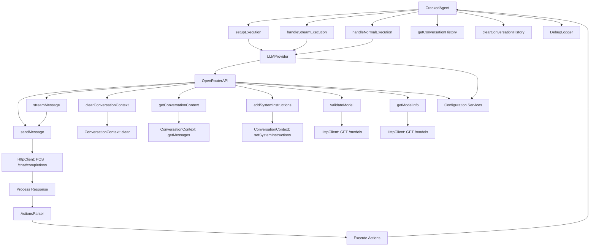

# Technical Architecture

## Overview

This document outlines the technical architecture of the Cracked Dev CLI application, focusing on the core components managing instructions and interactions with Large Language Models (LLMs). The application is built to be modular, allowing for easy integration and scaling of different LLM providers.

## Key Components

### 1. CrackedAgent

- **Purpose**: Manages overall execution and interaction processes.
- **Dependencies**:
  - `FileReader`: Reads and handles files for processing.
  - `LLMContextCreator`: Creates and manages context for LLM interactions.
  - `DebugLogger`: Logs debug information and details of operations.
  - `ActionsParser`: Parses and executes actions from LLM responses.
  - `StreamHandler`: Manages streaming interactions with the LLM.
- **Responsibilities**:
  - Validate and configure execution options.
  - Format user input messages for transmission to the LLM.
  - Control standard and streaming message transmissions.
  - Maintain and retrieve the conversation history.
  - Manage and execute actions derived from LLM responses.

### 2. LLMProvider

- **Purpose**: Acts as a unified interface for various LLM providers.
- **Responsibilities**:
  - Provide a consistent API for interaction regardless of the LLM provider.
  - Route messages to the appropriate provider based on user configuration.
  - Handle authentication and API token management.

### 3. OpenRouterAPI

- **Purpose**: Specifically implements the interface `ILLMProvider` for the OpenRouter LLM.
- **Responsibilities**:
  - Handle message sending and streaming to the OpenRouter API.
  - Manage conversation context within the interaction, including system instructions.
  - Verify the availability and appropriateness of models.
  - Handle API communication errors and retries.

### 4. FileReader

- **Purpose**: Reads and processes files based on user input.
- **Responsibilities**:
  - Read files from specified paths.
  - Format and preprocess file contents for the LLM.
  - Return file data to `CrackedAgent` for further processing.

### 5. ActionsParser

- **Purpose**: Parses and executes actions from LLM responses.
- **Responsibilities**:
  - Extract action tags from LLM responses.
  - Execute actions that need to be carried out after receiving LLM responses (e.g., file operations, system commands).

### 6. DebugLogger

- **Purpose**: Logs debug information for troubleshooting and development.
- **Responsibilities**:
  - Log detailed debug information about the execution process.
  - Enable or disable logging based on configuration settings.

### 7. LLMContextCreator

- **Purpose**: Creates and manages context for LLM interactions.
- **Responsibilities**:
  - Set initial and system instructions for LLM interactions.
  - Maintain conversation history and context.
  - Update context based on new interactions.

## Interactions and Flow

### Initialization

1. **CrackedAgent** is instantiated with all necessary dependencies injected.
2. **LLMProvider** is initialized and configured to use the OpenRouter provider by default.
3. **FileReader** is ready to read and process any files specified by the user.
4. **LLMContextCreator** is set up to initialize and manage the conversation context.

### Execution

1. **CrackedAgent.execute()** is invoked with user input and specific execution options.
2. Input options are validated and prepared according to application rules.
3. Messages, formatted to be clear and contextually relevant, are sent to the LLM provider through **LLMProvider**.
4. **LLMProvider**, based on the provider type (e.g., OpenRouter), directs messages further.
5. **OpenRouterAPI** then interacts with the OpenRouter API, sending or streaming messages as required.
6. Responses from the API are processed and added to the conversation context.
7. **ActionsParser** identifies any actions in these responses and triggers their execution.
8. **DebugLogger** logs each step of the process for debugging purposes.

### Actions Parsing & Execution

- After parsing the LLM responses, **ActionsParser** extracts and executes any planned actions. This can include file operations, system commands, or further API interactions.

### Configuration and Context Management

- Configuration for the application, including LLM provider settings, can be managed via `.env` files.
- **LLMContextCreator** manages the context and conversation history, ensuring that each session is appropriately continued from previous interactions.

## Diagram

Below is a Mermaid diagram illustrating the interaction between the key components.

