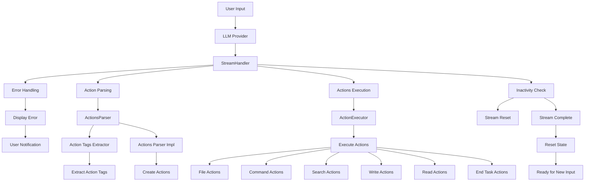

StreamHandler Documentation
===========================

### Overview

The `StreamHandler` class is a critical component within the `cracked-dev-cli` system, specifically designed to manage and process streaming responses from Language Learning Models (LLMs). It ensures that responses are correctly parsed, errors are handled gracefully, and actions embedded in the responses are executed accordingly. The class acts as a bridge between the LLM API responses and the client-side logic, maintaining an internal buffer and parsing state to handle incomplete or fragmented responses.

### Role in the System

- **Buffer Management**: Manages a response buffer to concatenate incoming chunks of text from the LLM.
- **Error Handling**: Formats and displays errors that occur during the streaming process, including context length exceeded, rate limit exceeded, and network errors.
- **Action Processing**: Parses actions embedded in the responses using the `ActionsParser` class and executes them in a controlled manner.
- **Inactivity Check**: Tracks the time of last activity to handle cases where the stream becomes inactive for a period longer than the defined threshold.
- **State Reset**: Resets the internal state after completing the processing of actions or encountering an error.

### Mermaid Diagram

### Main Functionalities and Interactions

1. **Handling Chunks**:
   - The `handleChunk` method processes each chunk of data received from the LLM.
   - It checks if the chunk is an error chunk and formats it if necessary.
   - It appends non-error chunks to an internal buffer and parsed actions.
   - It checks if a message is complete based on the parsed actions or if the stream is inactive.

2. **Error Display**:
   - The `displayError` method formats and displays errors in a user-friendly manner.
   - It logs errors using the `DebugLogger` class and outputs formatted error messages to the terminal.

3. **Action Parsing and Execution**:
   - The `ActionsParser` class is utilized to parse actions embedded in the LLM responses.
   - The `ActionExecutor` class is used to execute these parsed actions.
   - Various file actions, command actions, search actions, and more are handled by corresponding action classes.

4. **Inactivity Handling**:
   - The `isInactive` method checks if the stream has been inactive for longer than the set threshold.
   - If inactive, it marks the stream as complete and logs an appropriate message.

5. **State Management**:
   - The internal state is managed using properties like `responseBuffer`, `isStreamComplete`, and `lastActivityTimestamp`.
   - The `reset` method is used to reset these properties after processing or encountering an error.